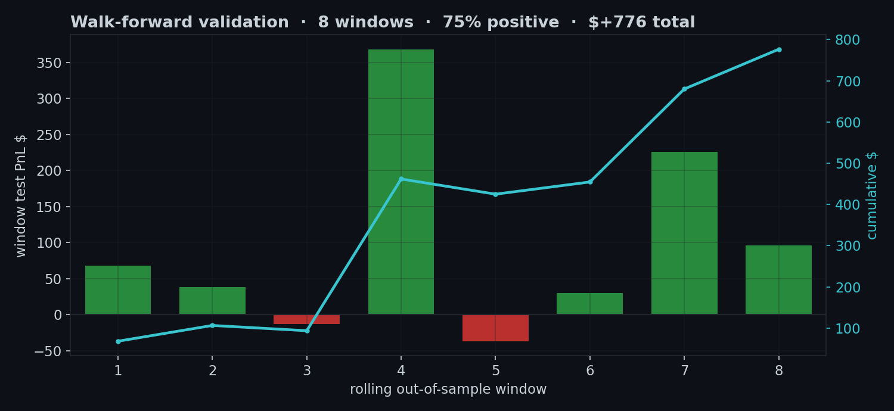
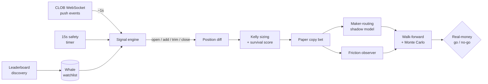
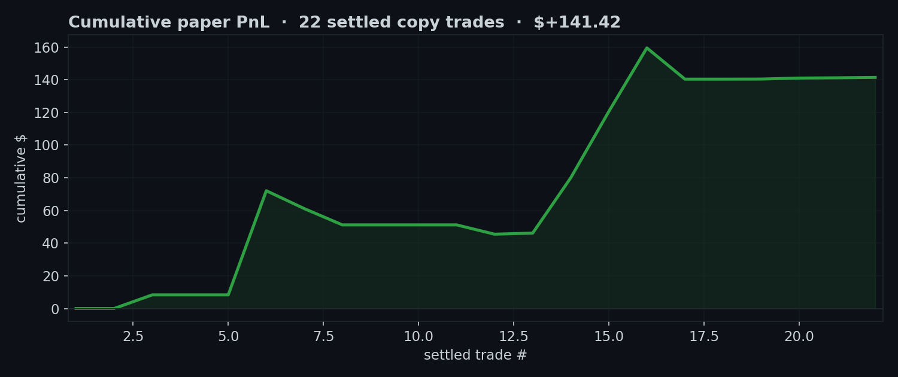
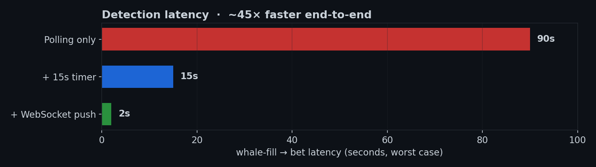

<div align="center">


<br><br>

# 🐋 polywhale

### Copy-trading intelligence for Polymarket whales

*Track the sharpest wallets on Polymarket, detect their moves within seconds, and mirror them with variance-adjusted position sizing — all validated with walk-forward backtesting before a cent of real money is risked.*

<br>

[](https://www.python.org/)
[](#-engineering)
[](https://github.com/astral-sh/ruff)
[](#-low-latency-detection)
[](#-deployment)
[](#-honest-status)

</div>

---

## 🌊 The idea

A small number of Polymarket wallets are reliably profitable. The signal isn't *that* they win — it's that **their entries move the closing line in their direction** (positive CLV), the one statistic that actually predicts long-run edge.

polywhale watches those wallets, reacts to their fills in **~1 second**, and mirrors them as paper trades sized by **fractional Kelly** — while continuously measuring the real-money friction (fees + slippage) that decides whether the edge survives contact with the order book.

Nothing ships to real money until a **walk-forward backtest** says the edge is real out-of-sample.

<div align="center">



<sub>Rolling train→test walk-forward over reconstructed position episodes — whales are ranked on each training window, then followed blindly on the next unseen one. Concentrated in two windows; small sample, shown for transparency.</sub>

</div>

---

## ⚡ How it works



| Stage | What happens |
|------|--------------|
| **Discover** | Weekly sweep scans the Polymarket leaderboard, filters by win rate / volume / portfolio value, and surfaces fresh candidates to Telegram |
| **Detect** | Dual-path detection — a persistent CLOB **WebSocket** daemon (sub-second) backed by a 15s polling safety net |
| **Decide** | Each move is filtered by playbook archetype (skip the un-copyable ones) and sized with **¼-Kelly** shrunk for sample size |
| **Mirror** | Recorded as a paper bet with VWAP entry, top-up handling, and per-whale conviction weighting |
| **Measure** | A maker-routing shadow model + friction observer compute what *real-money* execution would have cost |
| **Validate** | Rolling **walk-forward** windows and **Monte Carlo** bootstrap stress-test the edge before any capital is committed |

---

## ✨ Highlights

- 🛰️ **Low-latency detection** — async `websockets` daemon reacts to live trade events on hundreds of markets; detection latency cut from ~90s to ~1–3s
- 📐 **Fractional Kelly sizing** — per-whale stake from `f* = (μ − fees) / σ²`, shrunk toward an exploration stake until the sample is large enough to trust
- 🧬 **Survival scoring** — wallets ranked on sample size, maker/taker share, category focus, recovery factor, and return skew (grounded in 2026 prediction-market research)
- 🎭 **Archetype filtering** — structurally un-copyable playbooks (news-arb, insider, market-making) are detected and skipped
- 💸 **Maker-routing shadow model** — simulates limit-order fills + maker rebates to quantify achievable friction reduction
- 🔬 **Research-grade validation** — walk-forward, Monte Carlo, and a historical backtest engine that reconstructs position episodes from on-chain activity
- 🤖 **Telegram command bot** — `/pulse`, `/whales`, `/positions`, `/pnl` for live status from your pocket
- 🛡️ **Hardened deployment** — isolated systemd units with memory caps, WAL-mode SQLite, sequential migrations, zero shared state with neighbouring services

---

## 🚀 Quickstart

```bash
git clone https://github.com/DevAntsa/polywhale.git
cd polywhale
pip install -e .

polywhale migrate            # apply schema
polywhale whale-discover     # find candidate whales from the leaderboard
polywhale whale-fast --default --alert   # one detection pass
polywhale pulse              # at-a-glance system health
```

<details>
<summary><b>📟 Full command catalogue</b></summary>

<br>

**Detection & copy**
| Command | Purpose |
|---------|---------|
| `whale-ws` | Persistent WebSocket daemon (push-driven, ~1s) |
| `whale-fast` | One-shot snapshot → diff → alert (timer-driven) |
| `whale-watch` | Poll multiple wallets on an interval |
| `whale-signals` | Diff the last two snapshots into signals |

**Whale management**
| Command | Purpose |
|---------|---------|
| `whale-discover` | Leaderboard sweep for new candidates |
| `whale-survival` | Recompute survival scores + tiers |
| `whale-review` | Score every whale, recommend keep/drop |
| `watchlist` / `watchlist-add` / `watchlist-endorse` / `watchlist-archetype` | Curate the tracked set |

**Validation & analytics**
| Command | Purpose |
|---------|---------|
| `walk-forward` | Rolling train/test out-of-sample validation |
| `monte-carlo` | Bootstrap-resampled PnL projection |
| `historical-backfill` / `historical-backtest` | Reconstruct & replay position history |
| `friction-report` | Slippage + paper-to-real edge retention |
| `maker-routing-report` | Maker vs taker fill economics |

</details>

---

## 🔬 Validation methodology

Most "trading bots" report a single backtest number. polywhale treats validation as the product:

- **Walk-forward** — whales are ranked on a *training* window, then followed blindly on the next *unseen* window; consistency across windows separates edge from luck.
- **Monte Carlo** — bootstrap-resamples historical trade outcomes to map the distribution of plausible weekly returns, not just the mean.
- **Friction-first** — gross edge is meaningless until netted against measured fees and slippage; the friction observer makes that cost explicit per trade.
- **Adversarial research** — strategy assumptions are pressure-tested against academic literature and refuted when the data doesn't hold up.

> The headline finding so far: gross signal edge is real, but **friction is the binding constraint** — which is exactly why maker-side routing is the lead optimization.

<div align="center">



<sub>Cumulative <b>paper</b> PnL across settled copy trades. This is a transparency artifact, not a performance claim — the sample is small, simulated, and pre-friction; it exists to show the validation loop is live, not to project returns.</sub>

</div>

---

## 🛠️ Engineering

<div align="center">

| | |
|---|---|
| **Language** | Python 3.12, fully type-hinted |
| **Tests** | 229 passing · `pytest` · ruff-clean |
| **Modules** | 34 focused modules, single-responsibility |
| **Storage** | SQLite (WAL) with 16 sequential migrations |
| **Concurrency** | `asyncio` + bounded thread pools for parallel I/O |
| **External** | `httpx`, `websockets`, Polymarket CLOB + data API |
| **Deploy** | systemd timers & daemons on a €4/mo ARM VPS |

</div>

### Design choices worth noting

- **Idempotent, change-only writes** keep a high-cadence poller's disk growth bounded.
- **Shadow-mode everything** — maker routing and friction run as observers first, so real-money behaviour is fully measured before it's enabled.
- **TOCTOU-aware bankroll guard** is tracked as an explicit pre-real-money gate, not an afterthought.
- **Hard service isolation** — every unit has a `MemoryMax` so the OOM killer can never take down a co-hosted neighbour.

---

## 🛰️ Low-latency detection

<div align="center">



</div>

A single persistent connection subscribes to every market the tracked whales hold; any trade event triggers a **targeted** re-snapshot of only the wallets exposed to that market, then runs the diff → size → mirror pipeline in one reactive pass.

---

## 📟 Deployment

Runs unattended on a small ARM VPS via systemd:

```
whale-ws.service          persistent     WebSocket detection daemon
whale-fast.timer          every 15s      safety-net detection pass
telegram-poll.timer       every 30s      command bot
whale-discover.timer      weekly         new-candidate sweep
poly-paper-settle.timer   daily          settle resolved bets
```

Each unit is memory-capped and logs to its own file; deployment is a `git pull` + `pip install -e .` + `migrate`.

---

## ⚖️ Honest status

polywhale is in the **paper-trading validation phase**. It does not place real-money orders. Realized and unrealized PnL shown by `pulse` are simulated. Sample sizes are still small, and the maker-routing + bankroll-safety work that gates real capital is in progress.

This repository is a portfolio / research project. **Nothing here is financial advice.**

---

<div align="center">

*Built with a healthy respect for friction, variance, and the difference between a backtest and a bank balance.*

</div>
